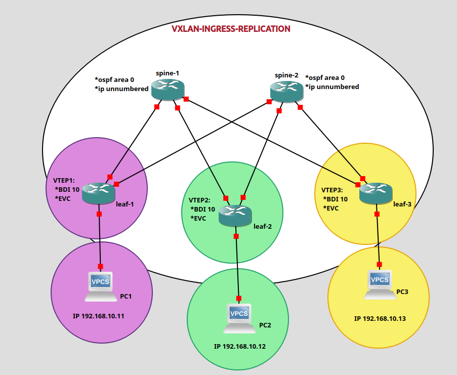

# VXLAN Ingress Replication Lab

A Cisco VXLAN lab implementing Ingress Replication as the BUM traffic forwarding mechanism, without relying on multicast.

### Features

- Layer 2 VXLAN Overlay
- Ingress Replication (Head-End Replication)
- OSPF Area 0 Underlay
- IP Unnumbered
- Ethernet Virtual Circuit (EVC)
- Bridge Domain Interface (BDI)
- Spine-Leaf Architecture
- VTEP Configuration

### Topology

### Verification

- OSPF Neighbor Adjacency
- VXLAN Tunnel Establishment
- NVE Peer Verification
- End-to-End Host Connectivity
- MAC Learning Across VTEPs

### Devices

- 2 × Spine Switches
- 3 × Leaf Switches (VTEPs)
- 3 × VPCS Hosts

### How to Use
1. Deploy the topology in EVE-NG.
2. Apply the configuration files from the `CONFIGS/` directory.
3. Verify OSPF neighbor adjacencies.
4. Verify NVE peer status.
5. Test end-to-end connectivity between hosts.

### Why Ingress Replication?

This lab demonstrates VXLAN using Head-End (Ingress) Replication instead of multicast for BUM traffic forwarding. It is suitable for environments where multicast is unavailable or unnecessary.

---

## Author

**Sina Sayadi**

Network Engineer | Cisco | SDN | Network Automation
